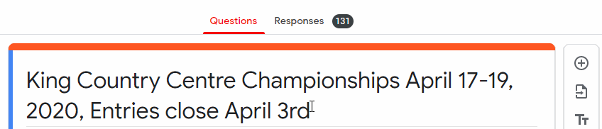
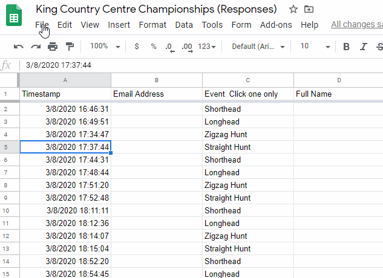

# Creating an entry form

Creating an online entry form is where it all starts. 

### Downloading the form for use in TrialManager
We recommend that you only download the entries once they have closed, so that you don't confuse yourself with multiple datasets.

### Using one form for multiple events

### Editing the entries in Excel/Google Sheets
Quite often, you'll want to edit the entries, or at least browse through them in a more compact manner than what you can do in Google Forms. Reasons for doing this include:

- Fixing incorrect entries
- To [add phone/mail entries](#adding-phonemail-entries)
- Separating [multiple events](#using-one-form-for-multiple-events) into different csv files

##### Editing in Excel
Start by [downloading](#downloading-the-form-for-use-in-trialmanager) the CSV file. From here, you can simply open it in Excel. Note that when saving, Excel might warn you that saving as CSV could result in losing some features. Ignore this, as no data will be lost.

##### Editing in Google Sheets
Start by exporting the entries from Google Forms. To do this, open the `Responses` tab of your Google Form, and click the `Create Spreadsheet` button. This will create a Sheets project in your Google Drive.

After you have editing your entries, you will need to download them from Sheets. To do this, go to the `File` menu. Select the `Download` sub-menu, and then click the `Comma-separated values (*.csv, current sheet) button

### Adding Phone/Mail Entries

Occasionally, we've found that some trialists simply cannot fill out an online form. Sometimes people are scared of the new format, but generally with strong encouragement we've found them to overcome that barrier and their feedback is positive. 

However, the most common reason that people cannot use the online form is that they simply don't have access to an internet-connected device. In this case, they'll have to resort back to the old standard of phone/mail entry. **Any entries performed in this way will need to be added to what you have collected online** - there are two ways of achieving this.

1. Go through the online entry form yourself, but enter the details they have given you over the phone/mail. This option works well and can be done easily anywhere, but can be more time consuming for large numbers of manual entries
2. After entries have closed and you have downloaded the CSV file, you can add each entry into the file (see [editing entries](#editing-the-entries-in-excelgoogle-sheets))