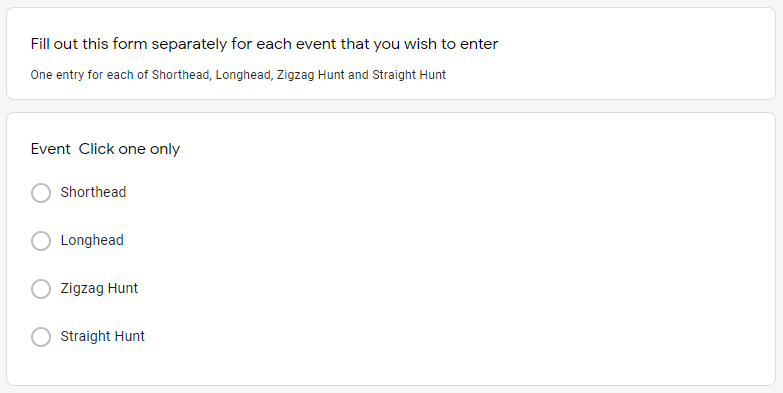
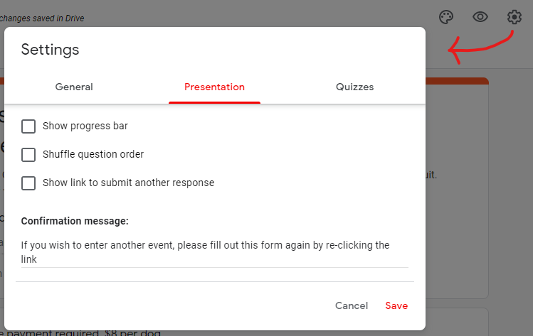
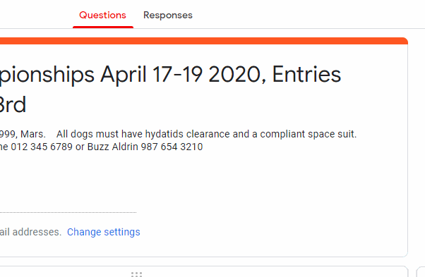
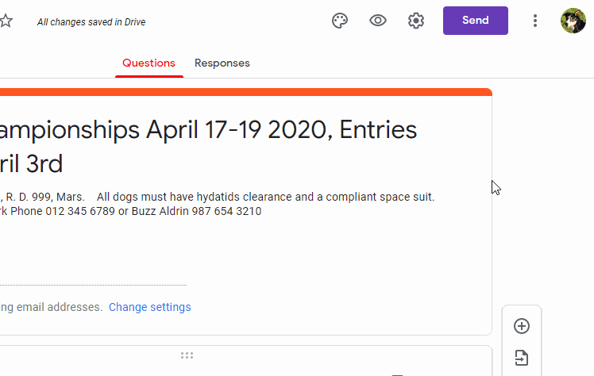

# Advanced Form Techniques

### Using one form for multiple events

Pretty much every trial will have multiple events. Take the 2020 King Country Centre Championships; said trial ran Shorthead, longhead, Zigzag hunt and Straight hunt events. Although creating a different form for each event is a perfectly valid strategy, we don't recommend it; this confuses participants and creates more work for you.

#### Setting up the form

Currently, our recommended method for condensing multiple events into one entry form is as follows:

1. Add a `Title and Description` "question", informing your users to fill out the form separately for each event that they want to enter
2. Add a `Multiple Choice` question that allows your users to select the event that they are filling out the form for
3. Click the settings icon in the top-right corner. In the menu that appears, go to the `Presentation` tab. Under the `Confirmation Message` section, write something along the lines of "If you wish to enter another event, please fill out this form again by re-clicking the link"

*Below: What your form should look like after steps 1 and 2*

*Below: Setting the confirmation message*

#### Formatting the data

Using the above technique does result in one hitch - each event will be placed into the same CSV file. You will need to separate each event into a separate file so that TrialManager can do its job. If you do not, TrialManager will place every entry into the same draw, regardless of 

Start by getting your data into a place where you can edit it - see [Editing Entries](download-edit-entries.md#editing-the-entries-in-excelgoogle-sheets)

### Adding Phone/Mail Entries

Occasionally, we've found that some trialists simply cannot fill out an online form. Sometimes people are scared of the new format, but generally with strong encouragement we've found them to overcome that barrier and their feedback is positive. 

However, the most common reason that people cannot use the online form is that they simply don't have access to an internet-connected device. In this case, they'll have to resort back to the old standard of phone/mail entry. **Any entries performed in this way will need to be added to what you have collected online** - there are two ways of achieving this.

1. Go through the online entry form yourself, but enter the details they have given you over the phone/mail. This option works well and can be done easily anywhere, but can be more time consuming for large numbers of manual entries
2. After entries have closed and you have downloaded the CSV file, you can add each entry into the file (see [editing entries](download-edit-entries.md#editing-the-entries-in-excelgoogle-sheets))

### Reusing Forms

Google Forms makes it easy to re-use the forms that you have already created. This means that you can simply update anything that has changed, such as date and address, while keeping the same questions as the last form. You can do this in two ways.

1. **Clear all the responses on an existing form**, and [distribute](#distributing-your-form) it again. This is the recommended method. Just remember to clear the responses each time you want to use it for a new trial!

    

2. **Make a copy of the form**, and [distribute](#distributing-your-form) the new copy

    

You can combine these methods to create one form per trial. Start by creating one entry form, then copy and adjust it for each trial that you would normally run in a year. Then, you can reuse each form every year by clearing the previous years responses.