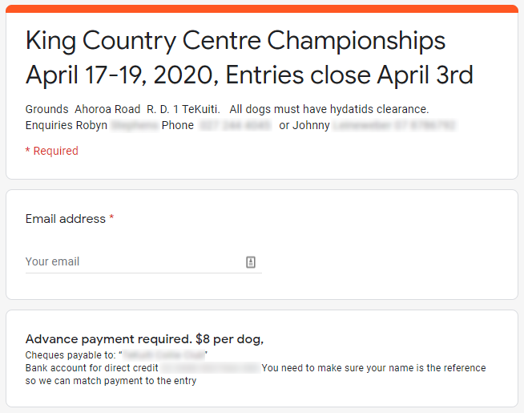
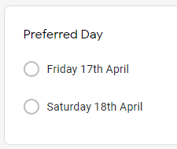
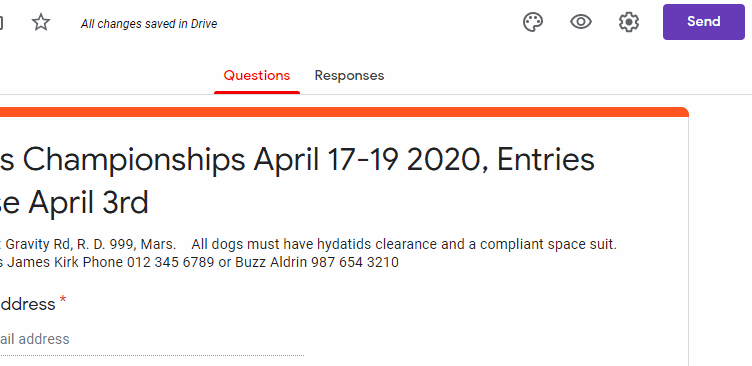

# Creating an entry form

Creating an online entry form is where it all starts. The simplest and most convenient way to achieve this (with guaranteed TrialManager compatibility!) is to create a Google Form. For guidance on creating and editing a Google Form, please read [Google's own documentation](https://support.google.com/docs/answer/6281888?hl=en&ref_topic=6063584).

To create and distribute a Google Form, you will need a Google Account. Even if you already have one, we would recommend that you **create a new one for your club**, as it will provide a dedicated space for you to create entry forms and conduct club communications via email.

### Exemplar form

We have created an [exemplar form](https://docs.google.com/forms/d/e/1FAIpQLSd9LCBHg58LT-zWfAv2ZcV5DBB7QD7Edr_QAxR0Zhgi8g70TQ/viewform?usp=sf_link) which we recommend you refer to while reading the documentation.

### Basic Requirements

Generally, you'll want your form to display information such as date, address, contact/payment info and important details such as dog clearance requirements. Furthermore, you may want to collect the participant's contact info and specify any other guidelines relevant to the entry.

However, there are some data points that **you must collect for TrialManager to operate**. TrialManager calls these 'properties'.

*Above: An example of providing trial info and collecting participant contact info*

### TrialManager Required Properties

TrialManager requires, at a minimum, the:

- full name,
- status,
- first dog name

from each trialist. We recommend that you use the `Short Answer` question type for names and the `Multiple Choice` question type for the status. **You will need to mark these questions as `Required` so that participants cannot skip them.** 

!!! note
    Each property must be put in its own question so that TrialManager can correctly recognise them

### TrialManager Optional Properties

TrialManager also accepts a number of properties that can enhance the draw creation process. **Each property requires its own question**. The optional properties are:

- Address, used to sort Trialists into the draw based on their distance to the trial grounds
- [Preferred day (see notes)](#preferred-day-info)
- Dog Two-Five Name (Use separate questions for each!)
- Dog One-Five Status (Use separate questions for each!)

##### Preferred Day Notes

It is imperative that you use the `Multiple Choice` question type when giving the entry form a Preferred Day option. This is because TrialManager cannot directly parse written dates, and therefore requires you to 'map' your written date to one that it can understand. Hence, if you give participants the option of writing in their own date, you will have to map tens, possibly hundreds of the different written dates that people enter. **Your preferred day question should look similar to below:**

### Distributing your form

Now that we've created a basic form, we need to send it to prospective trialists. The best way to do this is to get a link to the form and distribute via email, Facebook etc. To obtain a link, click the purple 'Send' button in the top-right corner of your form's design page. Switch to the `link` tab and copy/paste the provided link into an email or social media post.

!!! note
    On a small screen, the purple send button may turn into a right-facing arrow/paper plane icon

### Moving on

See [Advanced Form Techniques](advanced-forms.md) for information on:

- Using one form for multiple events
- Adding in phone/mail entries
- Reusing existing forms