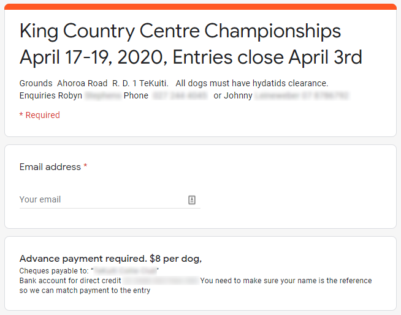
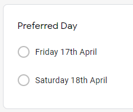

# Creating an entry form [WIP]

Creating an online entry form is where it all starts. The simplest and most convenient way to achieve this (with guaranteed TrialManager compatibility!) is to create a Google Form. For guidance on creating and editing a Google Form, please read [Google's own documentation](https://support.google.com/docs/answer/6281888?hl=en&ref_topic=6063584).

### Basic Requirements

Generally, you'll want your form to display information such as date, address, contact/payment info and important details such as dog clearance requirements. Furthermore, you may want to collect the participant's contact info and specify any other guidelines relevant to the entry.

However, there are some data points that **you must collect for TrialManager to operate**. TrialManager calls these 'properties'.

*Above: An example of providing trial info and collecting participant contact info*

### TrialManager Required Properties

TrialManager requires, at a minimum, the:

- full name,
- status,
- first dog name

from each trialist. We recommend that you use the `Short Answer` question type for names and the `Multiple Choice` question type for the status. **Each property requires its own question**.

### TrialManager Optional Properties

TrialManager also accepts a number of properties that can enhance the draw creation process. **Each property requires its own question**. The optional properties are:

- Address, used to sort Trialists into the draw based on their distance to the trial grounds
- [Preferred day (see notes)](#preferred-day-info)
- Dog Two-Five Name (Use separate questions for each!)
- Dog One-Five Status (Use separate questions for each!)

##### Preferred Day Notes

It is imperative that you use the `Multiple Choice` question type when giving the entry form a Preferred Day option. This is because TrialManager cannot directly parse written dates, and therefore requires you to 'map' your written date to one that it can understand. Hence, if you give participants the option of writing in their own date, you will have to map tens, possibly hundreds of the different written dates that people enter. **Your preferred day question should look similar to below:**

### Distributing your form

[TODO]

### Using one form for multiple events

[TODO]

### Adding Phone/Mail Entries

Occasionally, we've found that some trialists simply cannot fill out an online form. Sometimes people are scared of the new format, but generally with strong encouragement we've found them to overcome that barrier and their feedback is positive. 

However, the most common reason that people cannot use the online form is that they simply don't have access to an internet-connected device. In this case, they'll have to resort back to the old standard of phone/mail entry. **Any entries performed in this way will need to be added to what you have collected online** - there are two ways of achieving this.

1. Go through the online entry form yourself, but enter the details they have given you over the phone/mail. This option works well and can be done easily anywhere, but can be more time consuming for large numbers of manual entries
2. After entries have closed and you have downloaded the CSV file, you can add each entry into the file (see [editing entries](download-edit-entries.md#editing-the-entries-in-excelgoogle-sheets))

### Reusing Forms

Google Forms makes it easy to re-use the forms that you have already created. This means that you can simply update anything that has changed, such as date and address, while keeping the same questions as the last form. You can do this in two ways.

1. **Clear all the responses on an existing form**, and [distribute](#distributing-your-form) it again. This is the recommended method. Just remember to clear the responses each time you want to use it for a new trial!

    

2. **Make a copy of the form**, and [distribute](#distributing-your-form) the new copy

    

You can combine these methods to create one form per trial. Start by creating one entry form, then copy and adjust it for each trial that you would normally run in a year. Then, you can reuse each form every year by clearing the previous years responses.