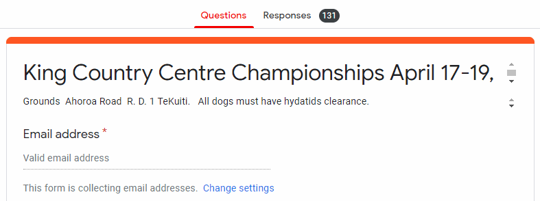
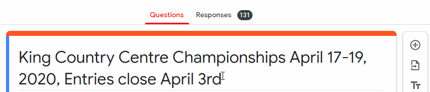
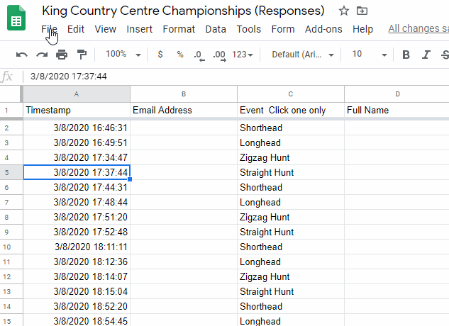

# Downloading and Editing Form Entries

### Downloading the form for use in TrialManager

TrialManager requires a CSV file containing your entries to operate. Google Forms makes it easy to download one directly.

Start by going to `Responses` tab and disallowing responses - flick the 'Accepting Responses' switch to the off position. Next, click on the 'overflow menu' - the three vertical dots, and select 'Download Responses (.csv)'. Watch the animated image below for a guide on this process.

This will download the data as a ZIP file. This is similar to a folder - simply double click on the ZIP file to open it and access the CSV file. At this point we recommend extracting the CSV file from the ZIP package, by right-clicking the ZIP file and selecting 'Extract All'. After this process is complete you can safely delete the ZIP file.

!!! note
    We recommend that you only download the entries once they have closed, so that you don't confuse yourself with multiple datasets.

### Editing the entries in Excel/Google Sheets

Quite often, you'll want to edit the entries, or at least browse through them in a more compact manner than what you can do in Google Forms. Reasons for doing this include:

- Fixing incorrect entries
- To [add phone/mail entries](create-google-form.md#adding-phonemail-entries)
- Separating [multiple events](create-google-form.md#using-one-form-for-multiple-events) into different csv files

##### Editing in Excel

Start by [downloading](#downloading-the-form-for-use-in-trialmanager) the CSV file. From here, you can simply open it in Excel. Note that when saving, Excel might warn you that saving as CSV could result in losing some features. Ignore this, as no data will be lost.

##### Editing in Google Sheets

Start by exporting the entries from Google Forms. To do this, open the `Responses` tab of your Google Form, and click the `Create Spreadsheet` button. This will create a Sheets project in your Google Drive.

After you have editing your entries, you will need to download them from Sheets. To do this, go to the `File` menu. Select the `Download` sub-menu, and then click the `Comma-separated values (*.csv, current sheet) button

