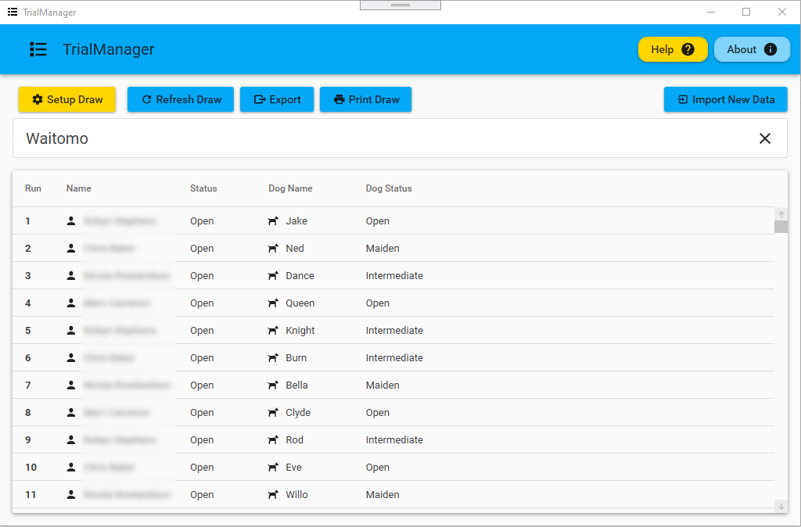
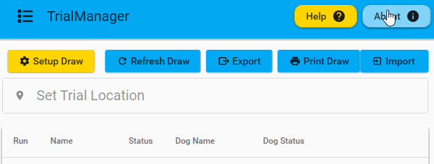

# TrialManager

### Download and Install

You can download the latest release of TrialManager from the [releases page](https://github.com/carlst99/TrialManager/releases/latest/). Download and install the `Setup.exe` file.

TrialManager will then keep itself up-to-date automatically, provided you open it while connected to the internet. 
If unsure, you can always compare the version number in the `About` menu with the latest release on the releases page

### First Steps

Unsure of where to start? A good place to begin would be with the guide on [creating a Google form](google-forms/create-google-form.md). From there, move on to [TODO]

### Diagnostics Acceptance

On the first-time run, TrialManager will ask you if you wish to report diagnostics data to the developer.
We recommend that you leave diagnostics enabled, as it allows us to easily fix issues that TrialManager may encounter while operating.
Note that you can change your decision regarding diagnostics at any time by accessing the about menu.

**Any data reported by diagnostics is completely anonymous and contains no personal information**

*Above: Changing acceptance in the about menu*